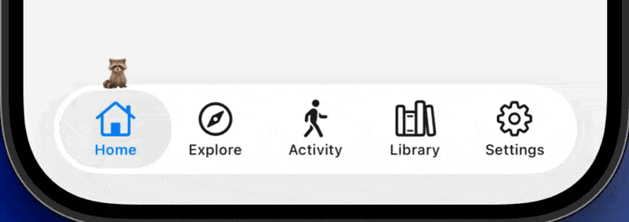
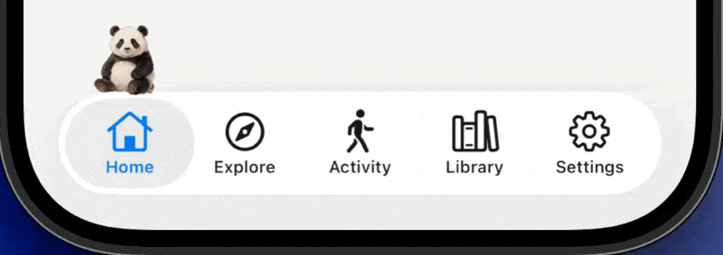

<div align="center">

# tabpet

A companion for your Expo tab bar.

[](https://www.npmjs.com/package/react-native-tabpet) [](LICENSE) [](assets/LICENSE-ART.md) 

<p>
  
  
</p>

</div>

tabpet puts a small animal on your iOS tab bar. It lives there now. It sits on the tab you picked, runs over when you pick another, and chases your finger when you drag along the bar. Leave it alone and it sits back down.

One Swift module measures the bar and streams its pan gesture. Everything else is a sprite sheet and a Reanimated worklet, which is why the package is thirteen megabytes and nearly all of it is pictures.

Six animals come in the box: a panda, a cat, a turtle, a raccoon, a bird and a squirrel. They do not move the same way. The panda is heavy and hops anyway. The raccoon, sent from one end of the bar to the other, goes underneath. The bird flies, which is cheating. The turtle never leaves the ground.

The seventh animal is yours. Three short clips from Sora, Seedance or Grok Imagine, one shell script, and an afternoon.

## What it does

- **Sits where you are.** The perch measures the real `UITabBar`, including the iOS 26 floating pill, so the companion lands centered on the selected icon rather than on a guess.
- **Runs on tab change.** Tap a tab and it runs there at a constant speed, with a hop for animals that hop. The turtle does not hop.
- **Takes the long way round.** Tap from the first tab to the last and the raccoon or squirrel goes over the end of the pill, upside down along its underside, and up the far side. Tap again mid-route and it turns around on the glass instead of cutting through it.
- **Chases your finger.** Drag along the bar and it follows, trailing a little behind like it is after a ball. The bar's own scrub keeps working.
- **Stands up when you are busy.** Hold a busy claim during a sync and it fidgets until you let go.

Reduce Motion is honored throughout. The companion is a button with an accessibility label.

## Install

Expo SDK 57+, New Architecture, a dev build. iOS only: the Swift module has no Android counterpart, so a cross-platform app gates the mount on `Platform.OS === 'ios'`.

```bash
npx expo install react-native-tabpet react-native-reanimated react-native-gesture-handler react-native-worklets expo-image react-native-safe-area-context
npx expo prebuild --clean --platform ios
npx expo run:ios
```

## Use

Wrap the root once:

```tsx
// app/_layout.tsx
import { CompanionProvider } from 'react-native-tabpet';
import { Stack } from 'expo-router';
import { GestureHandlerRootView } from 'react-native-gesture-handler';

export default function RootLayout() {
  return (
    <GestureHandlerRootView style={{ flex: 1 }}>
      <CompanionProvider>
        <Stack screenOptions={{ headerShown: false }} />
      </CompanionProvider>
    </GestureHandlerRootView>
  );
}
```

Mount one perch beside the tab navigator and tell it which tab is active:

```tsx
// app/(tabs)/_layout.tsx
import { CompanionPerch } from 'react-native-tabpet';
import { useSegments } from 'expo-router';
import { NativeTabs } from 'expo-router/unstable-native-tabs';
import { View } from 'react-native';

const TABS = [
  { name: 'index', label: 'Home' },
  { name: 'explore', label: 'Explore' },
  { name: 'settings', label: 'Settings' },
];

export default function TabsLayout() {
  const segments = useSegments() as string[];
  const active = segments[1] ?? 'index';
  const slotIndex = Math.max(
    0,
    TABS.findIndex((t) => t.name === active)
  );

  return (
    <View style={{ flex: 1 }}>
      <NativeTabs>
        {TABS.map((tab) => (
          <NativeTabs.Trigger key={tab.name} name={tab.name}>
            <NativeTabs.Trigger.Label>{tab.label}</NativeTabs.Trigger.Label>
          </NativeTabs.Trigger>
        ))}
      </NativeTabs>
      <CompanionPerch anchor={{ slotCount: TABS.length, slotIndex }} />
    </View>
  );
}
```

That is the whole integration. The perch lives above the navigator, so a tab change never unmounts it; switching tabs is just a run from one seat to the next.

Want only one animal? Import from `react-native-tabpet/bare` and register the one you ship. Want a picker, a busy state, or a custom tab bar? See the [integration guide](docs/integration.md).

## The animals

| animal   | temperament                                                        |
| -------- | ------------------------------------------------------------------ |
| panda    | heavy, unhurried, a small hop                                      |
| cat      | quick, snappy springs, sits like a cat                             |
| turtle   | crawls at its own pace, critically damped, never leaves the ground |
| raccoon  | small and fast, takes the long way round the pill                  |
| bird     | flies 14pt above the bar and lands                                 |
| squirrel | the fastest hop on the bar, also takes the long way round          |

Each one is three sprite sheets and a profile of springs, speeds, and seat measurements. The [profile reference](docs/profiles.md) lists every number, and the [art pipeline](docs/art-pipeline.md) has the prompts that ran in Sora, Seedance and Grok Imagine and the cut recipes that made them, so you can make your own in an afternoon.

## Docs

- [Integration guide](docs/integration.md), the host contract: mounting, pushed screens, bar drag, theme, custom bars
- [API reference](docs/api.md)
- [Profile reference](docs/profiles.md), every field and the bar it assumes
- [Art pipeline](docs/art-pipeline.md), generation prompts, cutting sheets, measuring a profile
- [How it works](docs/how-it-works.md), the seat, the run, the around route
- [Tools](tools/README.md), the sheet slicer and the frame-stack verifier

## Example app

```bash
bun install
cd apps/example
bunx expo prebuild --clean --platform ios
bunx expo run:ios
```

Five tabs on the iOS 26 floating bar, a busy button on Explore, the animal picker on Settings. Maestro flows live in `apps/example/maestro/`.

The simulator shows the seat, the run, and the around route. The finger chase and the bar's own scrub need a device.

## Contributing

`bun install`, then `bun run check` runs the leak gate, typecheck, format check, lint, and tests. Motion invariants and the verification recipe are in [CONTRIBUTING.md](CONTRIBUTING.md). Motion changes get a frame stack before merge, not a screenshot.

## License

- Code: [MIT](LICENSE).
- Art, the sprite sheets for all six animals: [CC BY 4.0](assets/LICENSE-ART.md). Use them in anything, commercial apps included, and credit "tabpet" somewhere in your app or repo; the license file lists the provenance and attribution of each sheet.
